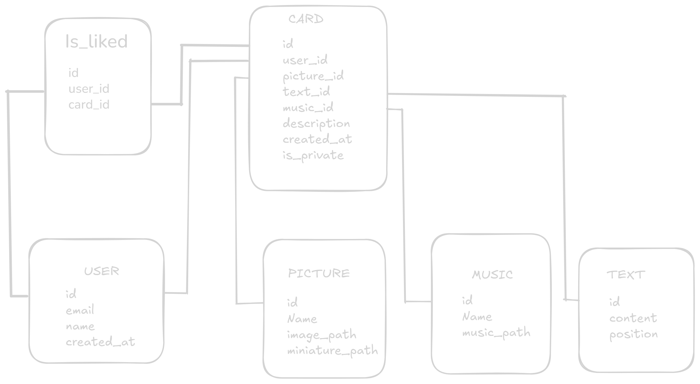

# Contexte

Ce projet est issu du checkpoint 4 de la formation DWWM de la Wild Code School. Il etait demandé de créer un site de A à Z avec un CRUD complet en 2 jours 1/2.

# Echoes

Echoes est une application web développée avec Next.js et TypeScript, c'est un blog/journal intime/réseau social qui permet de créer des "échos", petits articles ponctués d'animation pixel-art et de musique lofi.

## Fonctionnalités principales

- Créer des échos (articles)
- Gérer sa collection de création (édition/suppression/partage)
- Explorer les Echos publics des autres uttilisateurs
- Middleware pour la sécurité et la gestion des sessions
- Utilisation de modèles TypeScript pour la structure des données
- Intégration de fichiers multimédias (images, gifs, mp3)

## Base de Donnée



## Structure du projet

```
eslint.config.mjs
next-env.d.ts
next.config.ts
package.json
README.md
tsconfig.json
public/
  ... (images, gifs, mp3)
script/
  migrate.ts
  seed.ts
src/
  middleware.ts
  app/
    ... (pages Next.js)
  context/
  data/
  lib/
  model/
  service/
  ui/
  utils/
```

## Démarrage rapide

1. **Installer les dépendances** :
   ```bash
   npm install
   ```
2. **Lancer le serveur de développement** :
   ```bash
   npm run dev
   ```
3. **Accéder à l'application** :
   Ouvrez [http://localhost:3000](http://localhost:3000) dans votre navigateur.

## Scripts utiles

- `npm run dev` : Démarre le serveur Next.js en mode développement
- `npm run build` : Compile l'application pour la production
- `npm run start` : Démarre l'application en mode production
- `npm run lint` : Analyse le code avec ESLint
- `npm run db:migrate` : Génère la database
- `npm run db:seed` : Hydrate la database

## Technologies utilisées

- **Next.js**
- **TypeScript**
- **ESLint**
- **CSS Modules**

## Organisation du code

- `src/app/` : Pages et routes Next.js
- `src/model/` : Modèles de données TypeScript
- `src/service/` : Services pour la gestion des données
- `src/ui/` : Composants d'interface utilisateur
- `public/` : Fichiers statiques (images, gifs, mp3)
- `script/` : Scripts de migration et de seed

## Licence

Ce projet est sous licence MIT.
